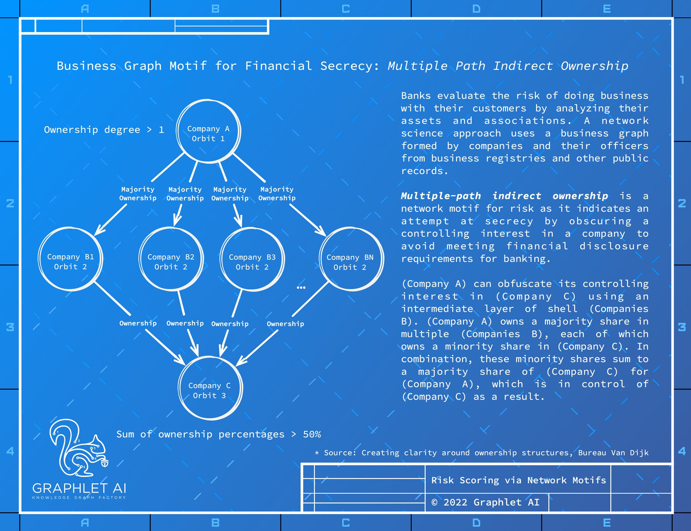
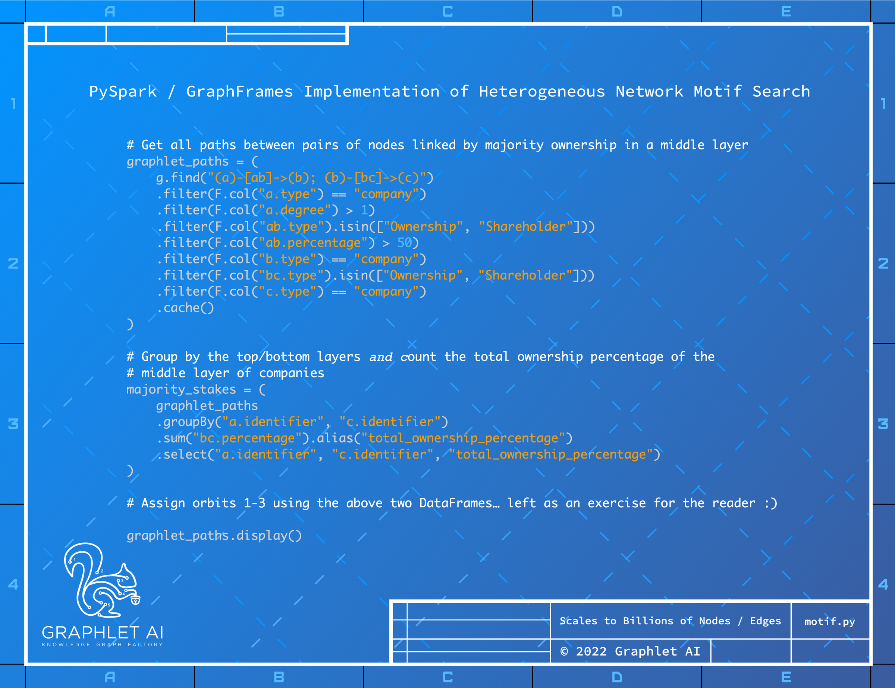

<p align="center">
    <h1 align="center">Graphlet AI Knowledge Graph Factory</h1>
</p>

<p align="center">
    
</p>

This is the PyPi module for the Graphlet AI Knowledge Graph Factory for building large _property graphs_. Our mission is to create a PySpark-based wizard for building large knowledge graphs that makes them easier to build for fewer dolalrs and with less risk.

## Motivaton

A [100-slide presentation on Graphlet AI](https://bit.ly/graphlet_ai_slides) explains where we are headed! The motivation for the project is described in [Knowledge Graph Factory: Extract, Transform, Resolve, Model, Predict, Explain](https://docs.google.com/document/d/1aGdZXzCPvHuzYeLk-VnrFGMZvPCq7o6XK9TrJCulQV4/edit?usp=sharing).

](images/Graphlet.AI%20Slides.png)

> The knowledge graph and graph database markets have long asked themselves: why aren't we larger? The vision of the semantic web was that many datasets could be cross-referenced between independent graph databases to map all knowledge on the web from myriad disparate datasets into one or more authoritative ontologies which could be accessed by writing SPARQL queries to work across knowledge graphs. The reality of dirty data made this vision impossible. Most time is spent cleaning data which isn't in the format you need to solve your business problems. Multiple datasets in different formats each have quirks. Deduplicate data using entity resolution is an unsolved problem for large graphs. Once you merge duplicate nodes and edges, you rarely have the edge types you need to make a problem easy to solve. It turns out the most likely type of edge in a knowledge graph that solves your problem easily is defined by the output of a Python program using the machine learning. For large graphs, this program needs to run on a horizontally scalable platform PySpark and extend rather than be isolated inside a graph databases. The quality of developer's experience is critical. In this talk I will review an approach to an Open Source Large Knowledge Graph Factory built on top of Spark that follows the ingest / build / refine / public / query model that open source big data is based upon.

&nbsp;&nbsp;&nbsp;&nbsp;--Russell Jurney in [Knowledge Graph Factory: Extract, Transform, Resolve, Model, Predict, Explain](https://docs.google.com/document/d/1aGdZXzCPvHuzYeLk-VnrFGMZvPCq7o6XK9TrJCulQV4/edit?usp=sharing)

## Core Features

This project is new, some features we are building are:

1) [Create Pandera / PySpark utilities graphlet.etl for transforming multiple datasets into a uniform ontology](https://github.com/Graphlet-AI/graphlet/issues/1)

2) [Create a generic, configurable system for entity resolution of heterogeneous networks](https://github.com/Graphlet-AI/graphlet/issues/3)

3) [Create an efficient pipeline for computing network motifs and aggregating higher order networks](https://github.com/Graphlet-AI/graphlet/issues/5)

4) [Implement efficient motif searching via neural subgraph matching](https://github.com/Graphlet-AI/graphlet/issues/4)

## Developer Setup

This project is in a state of development, things are still forming and changing. If you are here, it must be to contribute :)

### Dependencies

We manage dependencies with [poetry](https://python-poetry.org/) which are managed (along with most settings) in [pyproject.toml](pyproject.toml).

To install poetry, run:

```bash
curl -sSL https://install.python-poetry.org | python3 -
```

Then upgrade to poetry 1.2b3 (required for PyDantic non-binary install):

```bash
poetry self update --preview
```

To build the project, run:

```bash
poetry install
```

To add a PyPi package, run:

```bash
poetry add <package>
```

To add a development package, run:

```bash
poetry add --dev <package>
```

If you do edit [pyproject.toml](pyproject.toml) you must update to regenerate [poetry.lock](poetry.lock):

```bash
poetry update
```

### Pre-Commit Hooks

We use [pre-commit](https://pre-commit.com/) to run [black](https://github.com/psf/black), [flake8](https://flake8.pycqa.org/en/latest/), [isort](https://pycqa.github.io/isort/) and [mypy](http://mypy-lang.org/). This is configured in [.pre-commit-config.yaml](.pre-commit-config.yaml).

### VSCode Settings

The following [VSCode](https://code.visualstudio.com/) settings are defined for the project in [.vscode/settings.json](.vscode/settings.json) to ensure code is formatted consistent with our pre-commit hooks:

```json
{
    "editor.rulers": [90, 120],
    "[python]": {
        "editor.defaultFormatter": "ms-python.python",
        "editor.formatOnSave": true,
        "editor.codeActionsOnSave": {"source.organizeImports": true},
    },
    "python.jediEnabled": false,
    "python.languageServer": "Pylance",
    "python.linting.enabled": true,
    "python.formatting.provider": "black",
    "python.sortImports.args": ["--profile", "black"],
    "python.linting.pylintEnabled": false,
    "python.linting.flake8Enabled": true,
    "autoDocstring.docstringFormat": "numpy",
    "mypy.dmypyExecutable": "~/opt/anaconda3/envs/graphlet/bin/dmypy"
}
``` 

## System Architecture

The system architecture for Graphlet AI is based on a standard "Delta Architecture" that ingests, transforms, refines and publishes data for a graph database on top of a search engine to serve along with an MLOps platform for ML APIs.


This architecture is intended to optimize the construction of large knowledge graphs from multiple data sources and eventually using NLP - information extraction and entity linking.

## How do you build a knowledge graph? What is a knowledge graph factory?

The process of building a knowledge graph - a property graph - out of multiple large (and many small) datasets is described below. This is the process we are optimizing.

1. Assess the input datasets, come up with the [Pandera ontology classes](https://pandera.readthedocs.io/en/stable/schema_models.html#schema-models). What your graph will look like. I am using films as an example for the test dataset... horror.csv, comedy.csv, directors.csv... and it becomes Movies, Actors, Directors, Awards. So you create those classes and Directed, ActedIn, Won, etc. edges... as Pandera classes.
<br /><br />


2. Use the [Pandera classes](https://pandera.readthedocs.io/en/stable/schema_models.html#schema-models) that define your ontology to build custom transformation and validation of data so you instantiate a simple class to transform data from one format to another rather than writing independent implementations. Implement your ETL as part of these classes using Pandera functions in the class to efficiently transform and also validate data. Pandera validates the ENTIRE record, even if one field fails to parse... so you get ALL the fields' errors at once. The system will report every erroneous error rather than dying on the first error. This would make ETL *MUCH* faster. You will know all the issues up front, and can put checks in place to prevent creeper issues that kill productivity from making it through the early stages of te lengthy, complex ETL pipelines that large knowledge graph projects often create.

3. Take these classes that we have ETL'd the original datasets into, feed them into a Ditto style encoding and turn them into text documents and feed them into a Graph Attention Network (GAN) ER model.
<br /><br />


4. The ER model produces aggregate nodes with lots of sub-nodes... what we have called identities made up of entities.
<br /><br />


5. The same Pandera classes for the Ontology then contain summarization methods. Some kind of summarization interface that makes things simple. You got 25 addresses? You have an interface for reducing them. Turn things into fields with lists, or duplicate them.
<br /><br />
NOTE: At this point you have a knowledge graph (property graph) you can load anywhere - TigerGraph, Neo4j, Elasticsearch or OpenSearch.

6. Once this is accomplished, we build a graph DB on top of OpenSearch. The security-analytics project is going to do this, so we can wait for them and contribute to that project. Using an OpenSearch plugin reduces round-trip latency substantially, which makes scaling much easier for long walks that expand into many neighboring nodes.

7. Finally we create or use a middleware layer for an external API for the platform in front of MLFlow for MLOps / serving any live models and graph search and retrieval from OpenSearch.

8. Now that we have a clean property graph, we can pursue our network motif searching and motif-based representation learning.
<br /><br />
Tonight we will take over the world! Muhahahahahaha!
<br /><br />

<br /><br />
[GraphFrames](https://graphframes.github.io/graphframes/docs/_site/index.html) uses [PySpark DataFrames](https://spark.apache.org/docs/latest/api/python/reference/pyspark.sql/api/pyspark.sql.DataFrame.html#pyspark.sql.DataFrame) to perform [network motif search](https://graphframes.github.io/graphframes/docs/_site/user-guide.html#motif-finding) for known motifs until we [Implement efficient random motif searching via neural subgraph matching](https://github.com/Graphlet-AI/graphlet/issues/4).
<br /><br />
Below is an example of a network motif for financial compliance risk (KYC / AML) called Multiple-Path Beneficial Ownership for finding the ultimate beneficial owners a company that uses a layer of companies it owns between it and the asset it wishes to obscure. This motif indicates secrecy, not wrongdoing, but this is a risk factor.
<br /><br />

<br /><br />
Below is the [PySpark](https://spark.apache.org/docs/latest/api/python/reference/pyspark.sql/api/pyspark.sql.DataFrame.html#pyspark.sql.DataFrame) / [GraphFrames motif search](https://graphframes.github.io/graphframes/docs/_site/user-guide.html#motif-finding) code that detects this motif. While brute force searching for network motifs using MapReduce joins is not efficient, it does work well for finding known network motifs for most large networks. It is also flexible enough to search for variations, broadening results and providing domain experts with examples of variants from which to learn new motifs or expand existing motifs.
<br /><br />

* Motif Source: [Creating clarity around ownership structures, Bureau Van Dijk](https://www.bvdinfo.com/en-us/knowledge-base/white-papers/integrated-corporate-ownership-and-related-risk-poster)

Optimizing the above process is the purpose of Graphlet AI. We believe that if we make all of that easier, we can help more organizations successfully build large, enterprise knowledge graphs (property graphs) in less time and for less money.

## License

This project is created and published under the [Apache License, version 2.0](https://www.apache.org/licenses/LICENSE-2.0).

## Conventions

This project uses pre-commit hooks to enforce its conventions: git will reject commits that don't comply with our various flake8 plugins.

We use [numpy docstring format](https://numpydoc.readthedocs.io/en/latest/format.html#docstring-standard) on all Python classes and functions, which is enforced by [pydocstring](https://github.com/robodair/pydocstring) and [flake8-docstrings](https://gitlab.com/pycqa/flake8-docstrings).

We run `black`, `flake8`, `isort` and `mypy` in [.pre-commit-config.yaml](.pre-commit-config.yaml). All of these are configured in [pyproject.toml](pyproject.toml) except for flake8 which uses [`.flake8`](.flake8).
Flake8 uses the following plugins. We will consider adding any exceptions to the flake config that are warranted, but please document them in your pull requests.

```toml
flake8-docstrings = "^1.6.0"
pydocstyle = "^6.1.1"
flake8-simplify = "^0.19.2"
flake8-unused-arguments = "^0.0.10"
flake8-class-attributes-order = "^0.1.3"
flake8-comprehensions = "^3.10.0"
flake8-return = "^1.1.3"
flake8-use-fstring = "^1.3"
flake8-builtins = "^1.5.3"
flake8-functions-names = "^0.3.0"
flake8-comments = "^0.1.2"
```

## Entity Resolution (ER)

This project includes a Graph Attention Network implementation of an entity resolution model where node features are based on the [Ditto](https://github.com/megagonlabs/ditto) [encoding](https://github.com/megagonlabs/ditto/blob/master/ditto_light/summarize.py#L14-L135) defined in [Deep Entity Matching with Pre-Trained Language Models, Li et al, 2020](https://arxiv.org/abs/2004.00584).

For specifics, see [Issue 3: Create a generic, configurable system for entity resolution of heterogeneous networks
](https://github.com/Graphlet-AI/graphlet/issues/3)

### Why do Entity Resolution in Graphlet?

The motivation for Graphlet AI is to provide tools that facilitate the construction of networks for research into network motifs, motif search and motif-based representation learning. Without entity resolution... motif analysis does not work well.


### Entity Resolution Process

1. Transform Datasets into a Common Schemas in a Property Graph Ontology
<br /><br />
The first step in our ER process is to ETL multiple datasets into a common form - in silver tables - in our property graph ontology. Then a single model can be used for each type - rather than having to work across multiple schemas. This simplifies the implementation of entity resolution.
<br /><br />


2. Ditto Encode Nodes using Pre-Trained Language Models
<br /><br />
As mentioned above, we use the [Ditto](https://github.com/megagonlabs/ditto) [encoding](https://github.com/megagonlabs/ditto/blob/master/ditto_light/summarize.py#L14-L135) to encode documents as text documents with column name/type hints which we then embed using a pre-trained language model. Graph Neural Networks accept arbitrary input as features - we believe Ditto provides a general purpose encoding for multiple operations including entity resolution and link prediction.
<br /><br />


3. Blocking Records with Sentence Transformers and Locality Sensitive Hashing (LSH)
<br /><br />
Large knowledge graphs have too many records to perform an algebraic comparison of all records to all records - it is N^2 complexity!
<br /><br />

<br /><br />
We use [Sentence Transformers](https://sbert.net/) ([PyPi](https://pypi.org/project/sentence-transformers/)) ([Github](https://github.com/UKPLab/sentence-transformers)) for blocking, [as in Ditto](https://github.com/megagonlabs/ditto/tree/master/blocking). We incorporate network topological features in addition to node features in the blocker.<br /><br />

<br /><br />
Note: LSH is powerful for many operations using pairs of network nodes! Google Grale is described in [Grale: Designing Networks for Graph Learning, Halcrow et al, 2020](https://research.google/pubs/pub49831/) ([arXiv](https://arxiv.org/abs/2007.12002)) from Google Research. Grale is a powerful paper from Google Research LSH is an incredibly powerful algorithm - for large graph ML the algorithm isn't MapReduce - it is MapLSH - for approximate grouping.
<br /><br />
4. Entity Matching with Graph Attention Networks
<br /><br />
TBD :)
<br /><br />


### DBLP Training Data

[DBLP](https://dblp.org/) is a database of scholarly research in computer science.

The datasets we use are the actual DBLP data and a set of labels for entity resolution of authors.

* [DBLP Dataset](https://dblp.org/faq/How+can+I+download+the+whole+dblp+dataset.html) is available at [https://dblp.org/xml/dblp.xml.gz](https://dblp.org/xml/dblp.xml.gz).
* [DBLP Dataset 2](https://hpi.de/naumann/projects/repeatability/datasets/dblp-dataset.html) by [Prof. Dr. Felix Naumann](https://hpi.de/naumann/people/felix-naumann.html) available in [DBLP10k.csv](https://hpi.de/fileadmin/user_upload/fachgebiete/naumann/projekte/repeatability/DBLP/DBLP10k.csv) is a set of 10K labels (5K true, 5K false) for pairs of authors. We use it to train our entity resoultion model.

#### Collecting and Preparing the Training Data

The DBLP XML and the 50K ER labels are downloaded, parsed and transformed into a graph via `graphlet.dblp.__main__` via:

```bash
python -m graphlet.dblp
```

## Why property graphs? Why not RDF Triples and SPARQL?

We believe RDF/SPARQL are based on the false assumptions of the Semantic Web, which did not work out.


The reality is more like this, which our system is optimized for. At present we are not focusing on NLP, information extraction and entity linking in favor of tools optimized for building property graphs by using ETL to transform many datasets into a uniform ontology for solving problems using ML and information retrieval.


